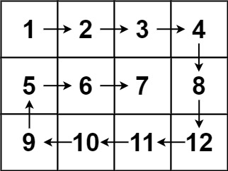

<h1> <a href = "https://leetcode.com/problems/spiral-matrix/description/" target = "_blank" >54. Spiral Matrix</a></h1>

<h3>Given an m x n matrix, return all elements of the matrix in spiral order.</h3>

Example1:

<strong>Input:</strong> matrix = [[1,2,3],[4,5,6],[7,8,9]]
 
<strong>Output:</strong> [1,2,3,6,9,8,7,4,5]

Example2:

<strong>Input: </strong>matrix = [[1,2,3,4],[5,6,7,8],[9,10,11,12]]
 

<strong>Output:</strong> [1,2,3,4,8,12,11,10,9,5,6,7]

<strong>Constraints:</strong>

<ul>
<li>m == matrix.length</li>
<li>n == matrix[i].length   </li>
<li>1 <= m, n <= 10</li>
<li>-100 <= matrix[i][j] <= 100</li>
</ul>
